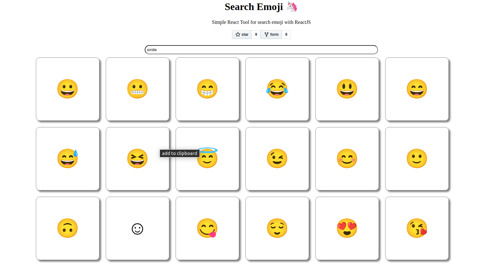

# Emoji App

add sources file inside the json.file

# installed extra packages:

- For the github button
  npm i react-github-btn for fork and start from github
  import GitHubButton from 'react-github-btn'

- For the clipboard
  npm i react-clipboard-simple
  import ReactClipboard from "react-clipboard-simple";

  
